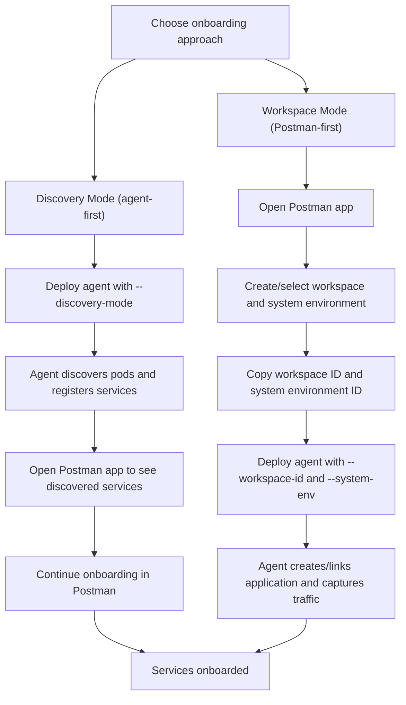
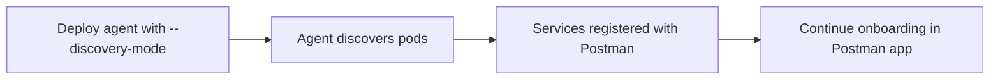
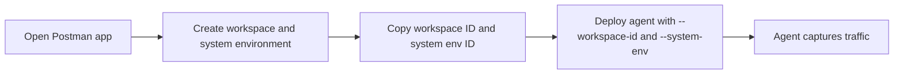
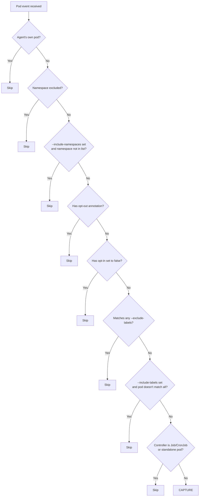

# Onboarding Services with the Postman Insights Agent

The Postman Insights Agent provides two recommended ways to onboard your services: **Discovery Mode** and **Workspace Mode**. Both replace the legacy `--project` and `--collection` flags with streamlined workflows that integrate directly with the Postman app.

## Choosing an onboarding approach

| Approach | How it works | Best for |
|---|---|---|
| **Discovery Mode** | Deploy the agent first. It automatically discovers your services from Kubernetes metadata and registers them with Postman. You then continue onboarding in the Postman app. | Teams with many microservices who want zero-configuration onboarding, or who want new services to be picked up automatically as they are deployed. |
| **Workspace Mode** | Start in the Postman app to create a workspace and system environment, copy the generated IDs, then configure the agent with those IDs. | Teams who prefer to set up the Postman side first, or who want each agent instance to map to a specific workspace and environment from the start. |

> **Legacy modes:** The `--project` and `--collection` flags still work but are no longer recommended. New deployments should use Discovery Mode or Workspace Mode.

> **API key permissions:** The Postman API key used by the agent must belong to a user with **write access** to the target workspaces (a workspace Admin or Super Admin). The agent creates and links applications on behalf of this user, so insufficient permissions will cause onboarding to fail.

Both approaches are available across all three deployment models: **DaemonSet**, **Sidecar**, and **Standalone**.

---

## Onboarding workflows

### Combined overview



### Discovery Mode workflow

Discovery mode is an agent-first approach. You deploy the agent with a single API key and it handles the rest.



### Workspace Mode workflow

Workspace mode is a Postman-first approach. You configure everything in Postman, then hand the IDs to the agent.



---

## Quickstart: Discovery Mode (DaemonSet)

The fastest way to get started is to deploy the agent as a DaemonSet with discovery mode enabled. This captures traffic from all eligible pods on every node in your cluster.

### Prerequisites

- A Postman API key with Insights permissions.
- A Kubernetes cluster (v1.19+).
- The agent image: `public.ecr.aws/postman/postman-insights-agent:latest`.

### 1. Apply the provided manifest

A ready-to-use manifest file is provided that includes the required Secret, ServiceAccount, RBAC rules, and DaemonSet definition. Replace the placeholder API key and apply it directly:

```bash
kubectl apply -f postman-insights-agent-discovery.yaml
```

The manifest deploys the agent as a DaemonSet with `--discovery-mode` enabled and references your API key via a Kubernetes Secret.

> If you need to customize the deployment (namespace filtering, label filtering, etc.), edit the manifest's `args` or `env` sections before applying. See [DaemonSet flags](#discovery-mode) for all available options.

### 2. Verify

Check the agent logs:

```bash
kubectl logs -n postman-insights-namespace -l app=postman-insights-agent --tail=50
```

You should see log lines indicating that pods are being discovered and services are being registered. Discovered services will appear in your Postman Insights dashboard, where you can continue the onboarding process.

---

## Deployment Modes

### DaemonSet (`kube run`)

The DaemonSet mode deploys one agent pod per node. It supports both Discovery Mode and Workspace Mode.

#### Discovery Mode

In discovery mode, a single cluster-level API key is used instead of per-pod credentials. The agent watches for pod events across the cluster and automatically starts capturing traffic for eligible pods.

```bash
postman-insights-agent kube run --discovery-mode [flags]
```

| Flag | Type | Default | Description |
|---|---|---|---|
| `--discovery-mode` | bool | `false` | Enable automatic service discovery. |
| `--include-namespaces` | string (comma-separated) | _(empty -- all non-excluded namespaces)_ | Only discover pods in these namespaces. |
| `--exclude-namespaces` | string (comma-separated) | _(empty -- uses built-in defaults)_ | Exclude pods in these namespaces, in addition to the [default excluded namespaces](#default-excluded-namespaces). |
| `--include-labels` | key=value pairs | _(empty)_ | Only capture pods that have **all** of these labels. |
| `--exclude-labels` | key=value pairs | _(empty)_ | Skip pods that match **any** of these labels. |
| `--rate-limit` | float | `0` (uses system default) | Maximum number of requests per minute to capture. |

All discovery flags can also be set via environment variables. CLI flags take precedence.

| Environment variable | Maps to flag | Format |
|---|---|---|
| `POSTMAN_INSIGHTS_DISCOVERY_MODE` | `--discovery-mode` | `"true"` to enable |
| `POSTMAN_INSIGHTS_INCLUDE_NAMESPACES` | `--include-namespaces` | Comma-separated list |
| `POSTMAN_INSIGHTS_EXCLUDE_NAMESPACES` | `--exclude-namespaces` | Comma-separated list |
| `POSTMAN_INSIGHTS_INCLUDE_LABELS` | `--include-labels` | Comma-separated `key=value` pairs |
| `POSTMAN_INSIGHTS_EXCLUDE_LABELS` | `--exclude-labels` | Comma-separated `key=value` pairs |

**Example: discover only in specific namespaces**

```bash
postman-insights-agent kube run \
  --discovery-mode \
  --include-namespaces=production,staging
```

Or equivalently via environment variables:

```yaml
env:
  - name: POSTMAN_INSIGHTS_DISCOVERY_MODE
    value: "true"
  - name: POSTMAN_INSIGHTS_INCLUDE_NAMESPACES
    value: "production,staging"
```

**Example: exclude pods by label**

```bash
postman-insights-agent kube run \
  --discovery-mode \
  --exclude-labels=team=infrastructure
```

#### Workspace Mode

In workspace mode, each pod that the DaemonSet monitors is associated with a specific workspace and system environment. The workspace and system environment IDs are typically set as environment variables on the pods being monitored, and the DaemonSet reads them automatically.

The DaemonSet picks up `POSTMAN_INSIGHTS_WORKSPACE_ID` and `POSTMAN_INSIGHTS_SYSTEM_ENV` from each target pod's environment and uses the Postman backend to create or link an application for that pod's service.

---

### Sidecar (`kube inject`)

Sidecar mode injects the agent as an additional container into your existing deployment YAML. It supports both onboarding approaches.

#### Discovery Mode

In discovery mode, the `--project` flag is no longer required. The agent registers the service automatically.

```bash
postman-insights-agent kube inject \
  -f <deployment.yaml> \
  --discovery-mode \
  [--service-name <name>] \
  [--cluster-name <cluster>] \
  [-o <output.yaml>]
```

| Flag | Type | Default | Description |
|---|---|---|---|
| `--discovery-mode` | bool | `false` | Enable automatic service discovery. Removes the requirement for `--project`. |
| `--service-name` | string | _(auto-derived)_ | Override the auto-derived service name. See [Service Name Derivation](#service-name-derivation). |
| `--cluster-name` | string | _(empty)_ | Kubernetes cluster name. Sent as discovery metadata; not derivable from manifests. |
| `-f`, `--file` | string | _(required)_ | Path to the Kubernetes YAML file to inject. |
| `-o`, `--output` | string | _(stdout)_ | Path to write the injected YAML. |
| `-s`, `--secret` | string | `"false"` | Whether to generate a Kubernetes Secret for the API key. Set to `"true"` to include in output, or provide a file path. |

**Example:**

```bash
postman-insights-agent kube inject \
  -f deployment.yaml \
  --discovery-mode \
  --service-name "my-namespace/my-service" \
  --cluster-name "production-cluster" \
  --secret \
  -o injected-deployment.yaml
```

#### What the generated manifest contains

The injected sidecar container in the output YAML includes:

- **Container name**: `postman-insights-agent`
- **Image**: `public.ecr.aws/postman/postman-insights-agent:latest`
- **Args**: Constructed from the onboarding mode flags. For example, `apidump --discovery-mode` (plus `--service-name` if provided), or `apidump --workspace-id <id> --system-env <id>`, or `apidump --project <id>`.
- **Environment variables** (always present):
  - `POSTMAN_INSIGHTS_API_KEY` -- the API key, either as a literal value or referenced from a Kubernetes Secret (`postman-agent-secrets` / `postman-api-key`) when the `--secret` flag is used.
  - `POSTMAN_K8S_NODE`, `POSTMAN_K8S_NAMESPACE`, `POSTMAN_K8S_POD`, `POSTMAN_K8S_HOST_IP`, `POSTMAN_K8S_POD_IP` -- automatically populated from Kubernetes pod metadata via the downward API.
- **Environment variables** (discovery mode only):
  - `POSTMAN_INSIGHTS_CLUSTER_NAME` -- set when `--cluster-name` is provided.
  - `POSTMAN_INSIGHTS_WORKLOAD_NAME` -- auto-derived from the Deployment name in the input manifest.
  - `POSTMAN_INSIGHTS_WORKLOAD_TYPE` -- set to `Deployment` (derived from the input manifest).
  - `POSTMAN_INSIGHTS_LABELS` -- JSON-encoded map of the Deployment's labels from the input manifest.
- **Resources**: 200m CPU / 500Mi memory (requests and limits)
- **Security**: `NET_RAW` capability (required for packet capture)

> **Note on API key handling:** By default, the API key is embedded as a literal environment variable in the sidecar container spec. Use the `--secret` flag to instead reference it from a Kubernetes Secret named `postman-agent-secrets` (key: `postman-api-key`). The secret can be generated automatically as part of the injection, or created separately with `postman-insights-agent kube secret`.

#### Workspace Mode

In workspace mode, provide the workspace and system environment IDs directly via CLI flags. The agent uses these to create or link an application in the Postman API Catalog.

```bash
postman-insights-agent kube inject \
  -f <deployment.yaml> \
  --workspace-id <YOUR_WORKSPACE_ID> \
  --system-env <YOUR_SYSTEM_ENV_ID> \
  [-o <output.yaml>]
```

| Flag | Type | Default | Description |
|---|---|---|---|
| `--workspace-id` | string (UUID) | _(empty)_ | Your Postman workspace ID. Mutually exclusive with `--project` and `--discovery-mode`. |
| `--system-env` | string (UUID) | _(empty)_ | Your system environment ID. Required when `--workspace-id` is specified. |

**Example:**

```bash
postman-insights-agent kube inject \
  -f deployment.yaml \
  --workspace-id "550e8400-e29b-41d4-a716-446655440000" \
  --system-env "7c9e6679-7425-40de-944b-e07fc1f90ae7" \
  --secret \
  -o injected-deployment.yaml
```

> **Note:** Exactly one of `--project`, `--workspace-id`, or `--discovery-mode` must be specified.

---

### Standalone (`apidump`)

Standalone mode runs the agent directly on a host (outside of Kubernetes orchestration). It supports both onboarding approaches.

#### Discovery Mode

In discovery mode, the agent registers the service with the backend and begins capturing traffic without requiring a project ID, collection ID, or workspace ID.

```bash
postman-insights-agent apidump --discovery-mode [--service-name <name>]
```

| Flag | Type | Default | Description |
|---|---|---|---|
| `--discovery-mode` | bool | `false` | Enable automatic service discovery. Bypasses the `--project` / `--collection` / `--workspace-id` requirement. |
| `--service-name` | string | _(auto-derived)_ | Override the auto-derived service name. |

| Environment variable | Description |
|---|---|
| `POSTMAN_INSIGHTS_DISCOVERY_MODE` | Set to `"true"` to enable discovery mode. |
| `POSTMAN_INSIGHTS_SERVICE_NAME` | Override the auto-derived service name. |

**Example:**

```bash
POSTMAN_INSIGHTS_DISCOVERY_MODE=true \
POSTMAN_INSIGHTS_SERVICE_NAME=my-service \
postman-insights-agent apidump
```

#### Workspace Mode

In workspace mode, the agent uses the provided IDs to create or link an application for the given workspace and environment, then begins capturing traffic.

```bash
postman-insights-agent apidump \
  --workspace-id <YOUR_WORKSPACE_ID> \
  --system-env <YOUR_SYSTEM_ENV_ID>
```

| Flag | Type | Default | Description |
|---|---|---|---|
| `--workspace-id` | string (UUID) | _(empty)_ | Your Postman workspace ID. |
| `--system-env` | string (UUID) | _(empty)_ | Your system environment ID. Required when `--workspace-id` is set. |

| Environment variable | Description |
|---|---|
| `POSTMAN_INSIGHTS_WORKSPACE_ID` | Your Postman workspace ID. |
| `POSTMAN_INSIGHTS_SYSTEM_ENV` | Your system environment ID. |

**Example using environment variables:**

```bash
export POSTMAN_INSIGHTS_WORKSPACE_ID="<YOUR_WORKSPACE_ID>"
export POSTMAN_INSIGHTS_SYSTEM_ENV="<YOUR_SYSTEM_ENV_ID>"
postman-insights-agent apidump
```

> **Note:** `--workspace-id` is mutually exclusive with `--project` and `--collection`. You cannot combine them.

---

## Pod Filtering (Discovery Mode)

In DaemonSet discovery mode, the agent applies a multi-layer filtering pipeline to determine which pods to capture. Pods must pass every layer to be captured.

### Layer 0: Self-exclusion

The agent's own pod is always excluded from capture to avoid feedback loops.

### Layer 1: Namespace filtering

System and infrastructure namespaces are excluded by default. You can customize this behavior with `--include-namespaces` and `--exclude-namespaces`.

**Rules:**

1. If a pod's namespace is in the **exclude** list, the pod is skipped.
2. If `--include-namespaces` is set and the pod's namespace is **not** in the include list, the pod is skipped.
3. Otherwise, the pod passes this layer.

The exclude list always starts with the [default excluded namespaces](#default-excluded-namespaces). Any namespaces you specify with `--exclude-namespaces` are **added** to this list.

#### Default excluded namespaces

The following namespaces are excluded by default:

| | | | |
|---|---|---|---|
| `argocd` | `calico-system` | `cert-manager` | `cilium` |
| `crossplane-system` | `external-secrets` | `flux-system` | `gatekeeper-system` |
| `grafana` | `ingress-nginx` | `istio-system` | `jaeger` |
| `kube-node-lease` | `kube-public` | `kube-system` | `kyverno` |
| `linkerd` | `logging` | `metallb-system` | `monitoring` |
| `postman-insights-namespace` | `prometheus` | `tekton-pipelines` | `traefik` |
| `velero` | | | |

### Layer 2: Label and annotation filtering

This layer provides fine-grained control over individual pods using Kubernetes labels and annotations.

**Evaluation order:**

1. **Opt-out annotation** -- If the pod has the annotation `postman.com/insights-disabled: "true"`, it is skipped.
2. **Opt-in annotation set to false** -- If the pod has the annotation `postman.com/insights-enabled: "false"`, it is skipped.
3. **Exclude labels** -- If the pod matches **any** key-value pair in `--exclude-labels`, it is skipped.
4. **Include labels** -- If `--include-labels` is set, the pod must match **all** specified key-value pairs to pass. Pods missing any of the required labels are skipped.

#### Per-pod opt-out

To exclude a specific pod (or all pods in a Deployment) from discovery, add this annotation to the pod template:

```yaml
metadata:
  annotations:
    postman.com/insights-disabled: "true"
```

#### Per-pod opt-in control

To explicitly disable discovery for a pod that would otherwise be captured:

```yaml
metadata:
  annotations:
    postman.com/insights-enabled: "false"
```

### Layer 3: Controller type filtering

Only pods managed by long-running workload controllers are captured. This prevents the agent from capturing traffic from ephemeral or one-off workloads.

| Controller type | Captured? |
|---|---|
| **Deployment** (via ReplicaSet) | Yes |
| **StatefulSet** | Yes |
| **DaemonSet** | Yes |
| **Job** | No |
| **CronJob** | No |
| **Standalone pod** (no controller) | No |

### Filtering flowchart



---

## Service Name Derivation (Discovery Mode)

When a pod passes all filters, the agent derives a service name in the format:

```
{namespace}/{workload-name}
```

The **workload name** is resolved using the following fallback chain (first match wins):

| Priority | Source | Example |
|---|---|---|
| 1 | **Owner reference name** -- For Deployments, the ReplicaSet hash suffix (e.g., `-5d4b7c8f9a`) is stripped to recover the Deployment name. | Pod `my-app-5d4b7c8f9a-x2k4j` owned by ReplicaSet `my-app-5d4b7c8f9a` resolves to `my-app` |
| 2 | **`app.kubernetes.io/name` label** | Label `app.kubernetes.io/name: payment-service` resolves to `payment-service` |
| 3 | **`app` label** | Label `app: checkout` resolves to `checkout` |
| 4 | **Pod name prefix** -- The last `-suffix` segment is stripped from the pod name. | Pod `api-gateway-7f8c9` resolves to `api-gateway` |

The **workload type** is also derived for metadata purposes:

| Owner kind | Reported workload type |
|---|---|
| ReplicaSet | `Deployment` |
| StatefulSet | `StatefulSet` |
| DaemonSet | `DaemonSet` |

### Overriding the service name

You can override the auto-derived name on a per-pod basis by setting the `POSTMAN_INSIGHTS_SERVICE_NAME` environment variable in the pod spec:

```yaml
env:
  - name: POSTMAN_INSIGHTS_SERVICE_NAME
    value: "custom-namespace/custom-name"
```

For the sidecar and standalone modes, use the `--service-name` CLI flag:

```bash
postman-insights-agent apidump --discovery-mode --service-name "my-namespace/my-service"
```

---

## Environment Variables Reference

| Environment variable | Applies to | Description |
|---|---|---|
| `POSTMAN_INSIGHTS_API_KEY` | All | The Postman API key used for authentication. |
| `POSTMAN_INSIGHTS_DISCOVERY_MODE` | DaemonSet, Sidecar, Standalone | Set to `"true"` to enable discovery mode. |
| `POSTMAN_INSIGHTS_SERVICE_NAME` | Sidecar, Standalone | Override the auto-derived service name (discovery mode). |
| `POSTMAN_INSIGHTS_INCLUDE_NAMESPACES` | DaemonSet | Comma-separated list of namespaces to include (discovery mode). |
| `POSTMAN_INSIGHTS_EXCLUDE_NAMESPACES` | DaemonSet | Comma-separated list of namespaces to exclude, added to defaults (discovery mode). |
| `POSTMAN_INSIGHTS_INCLUDE_LABELS` | DaemonSet | Comma-separated `key=value` pairs. Pods must match **all** labels (discovery mode). |
| `POSTMAN_INSIGHTS_EXCLUDE_LABELS` | DaemonSet | Comma-separated `key=value` pairs. Pods matching **any** label are excluded (discovery mode). |
| `POSTMAN_INSIGHTS_WORKSPACE_ID` | DaemonSet, Sidecar, Standalone | Your Postman workspace ID (workspace mode). |
| `POSTMAN_INSIGHTS_SYSTEM_ENV` | DaemonSet, Sidecar, Standalone | Your system environment ID (workspace mode). Required when workspace ID is set. |
| `POSTMAN_INSIGHTS_CLUSTER_NAME` | Sidecar (discovery mode) | Kubernetes cluster name, sent as discovery metadata. Set by the `--cluster-name` flag in `kube inject`. |
| `POSTMAN_INSIGHTS_WORKLOAD_NAME` | Sidecar (discovery mode) | Workload name, auto-derived from the Deployment name in the input manifest. |
| `POSTMAN_INSIGHTS_WORKLOAD_TYPE` | Sidecar (discovery mode) | Workload type (e.g., `Deployment`), auto-derived from the input manifest. |
| `POSTMAN_INSIGHTS_LABELS` | Sidecar (discovery mode) | JSON-encoded map of the Deployment's labels, auto-derived from the input manifest. |

CLI flags always take precedence over environment variables.

---

## CLI Flags Reference

### `kube run` (DaemonSet)

**Discovery mode flags:**

| Flag | Type | Default | Description |
|---|---|---|---|
| `--discovery-mode` | bool | `false` | Enable automatic service discovery. |
| `--include-namespaces` | string | _(empty)_ | Comma-separated namespaces to include. |
| `--exclude-namespaces` | string | _(empty)_ | Comma-separated namespaces to exclude (added to defaults). |
| `--include-labels` | key=value | _(empty)_ | Labels that pods must have to be captured. |
| `--exclude-labels` | key=value | _(empty)_ | Labels that exclude pods from capture. |

### `kube inject` (Sidecar)

**Onboarding mode flags (mutually exclusive -- exactly one of `--project`, `--workspace-id`, or `--discovery-mode` must be specified):**

| Flag | Type | Default | Description |
|---|---|---|---|
| `--project` | string | _(empty)_ | Your Postman Insights project ID (legacy mode). |
| `--discovery-mode` | bool | `false` | Enable automatic service discovery. Removes the `--project` requirement. |
| `--workspace-id` | string (UUID) | _(empty)_ | Your Postman workspace ID. Mutually exclusive with `--project` and `--discovery-mode`. |
| `--system-env` | string (UUID) | _(empty)_ | Your system environment ID. Required when `--workspace-id` is specified. |
| `--service-name` | string | _(auto-derived)_ | Override the auto-derived service name (discovery mode). |
| `--cluster-name` | string | _(empty)_ | Kubernetes cluster name, sent as discovery metadata. |

**General flags:**

| Flag | Type | Default | Description |
|---|---|---|---|
| `-f`, `--file` | string | _(required)_ | Path to the Kubernetes YAML file to inject. |
| `-o`, `--output` | string | _(stdout)_ | Path to write the injected YAML. |
| `-s`, `--secret` | string | `"false"` | Whether to generate a Kubernetes Secret for the API key. Set to `"true"` to include in output, or provide a file path. |

### `apidump` (Standalone)

**Discovery mode flags:**

| Flag | Type | Default | Description |
|---|---|---|---|
| `--discovery-mode` | bool | `false` | Enable automatic service discovery. Bypasses `--project` / `--collection` / `--workspace-id`. |
| `--service-name` | string | _(auto-derived)_ | Override the auto-derived service name. |

**Workspace mode flags:**

| Flag | Type | Default | Description |
|---|---|---|---|
| `--workspace-id` | string (UUID) | _(empty)_ | Your Postman workspace ID. Mutually exclusive with `--project` and `--collection`. |
| `--system-env` | string (UUID) | _(empty)_ | Your system environment ID. Required when `--workspace-id` is set. |

---

## FAQ and Troubleshooting

### Which onboarding approach should I use?

- Use **Discovery Mode** if you want the agent to find and register services automatically. This is the fastest path when you have many services or want zero-configuration onboarding. After deploying the agent, continue the onboarding process in the Postman app.
- Use **Workspace Mode** if you want to set up your workspace and environment in Postman first, then point the agent at those specific IDs.
- Avoid the legacy `--project` and `--collection` flags for new deployments.

### Why isn't my pod being discovered?

Check each filtering layer in order:

1. **Namespace** -- Is the pod in a [default excluded namespace](#default-excluded-namespaces)? If so, either move the workload or use `--include-namespaces` to explicitly include it.
2. **Labels** -- Does the pod match an `--exclude-labels` pattern? Does it satisfy all `--include-labels` requirements?
3. **Annotations** -- Does the pod have `postman.com/insights-disabled: "true"` or `postman.com/insights-enabled: "false"`?
4. **Controller type** -- Is the pod managed by a Deployment, StatefulSet, or DaemonSet? Jobs, CronJobs, and standalone pods are not captured.

### How do I opt a specific pod out of discovery?

Add the opt-out annotation to the pod (or the pod template in the Deployment):

```yaml
metadata:
  annotations:
    postman.com/insights-disabled: "true"
```

### How do I limit discovery to specific namespaces?

Use the `--include-namespaces` flag. When set, **only** pods in the listed namespaces are discovered (default exclusions still apply).

```bash
postman-insights-agent kube run \
  --discovery-mode \
  --include-namespaces=production,staging
```

### How do I add extra namespaces to the exclusion list?

Use `--exclude-namespaces`. These are added to the built-in defaults -- they do not replace them.

```bash
postman-insights-agent kube run \
  --discovery-mode \
  --exclude-namespaces=dev,sandbox
```

### The derived service name is wrong. How do I fix it?

Set the `POSTMAN_INSIGHTS_SERVICE_NAME` environment variable in the affected pod's spec to provide a custom name. For sidecar and standalone deployments, use the `--service-name` flag instead.

### Will traffic be captured twice if I run both a DaemonSet and a sidecar on the same pod?

No. The DaemonSet automatically detects pods that already have the Postman Insights Agent sidecar container (`public.ecr.aws/postman/postman-insights-agent:latest`) and skips them. This check is applied consistently across pod watch events, the initial pod scan, and periodic health-check reconciliation.

### Can I use discovery mode and workspace mode in the same cluster?

Yes. The DaemonSet automatically skips any pod that already has the Postman Insights Agent sidecar container, so there is no risk of capturing traffic twice. You can safely run a discovery-mode DaemonSet alongside sidecar-injected deployments that use workspace mode (or vice versa).

### Can I use discovery mode and legacy `--project` mode in the same cluster?

This is technically possible -- the DaemonSet skips pods that already have the agent sidecar container, so traffic will not be captured twice. However, mixing legacy `--project` mode with discovery mode is **not recommended** and may not be supported in future releases. We strongly encourage migrating all workloads to either Discovery Mode or Workspace Mode.

### What format should the workspace ID and system environment ID be in?

Both must be valid UUIDs (e.g., `550e8400-e29b-41d4-a716-446655440000`). You can copy them directly from the Postman app.

### What happens if I set `--workspace-id` without `--system-env`?

The agent will exit with an error. The `--system-env` flag is required whenever `--workspace-id` is specified.
