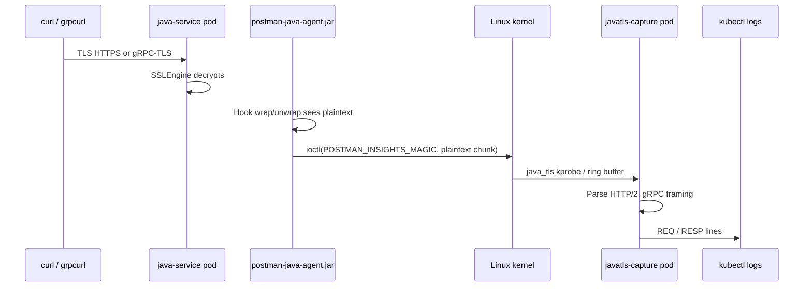
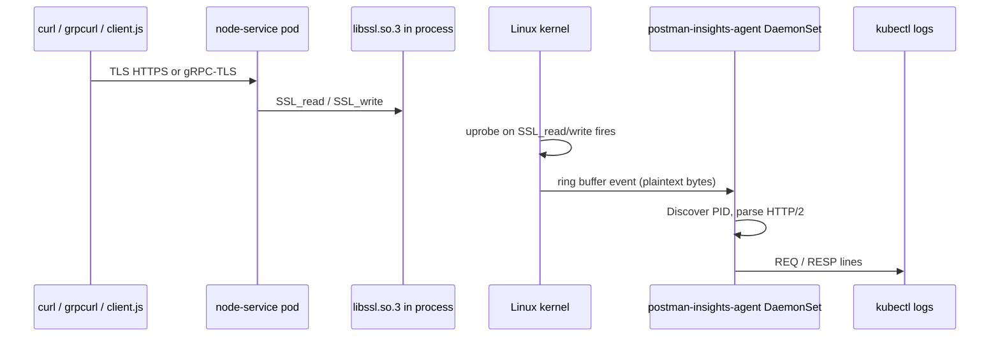
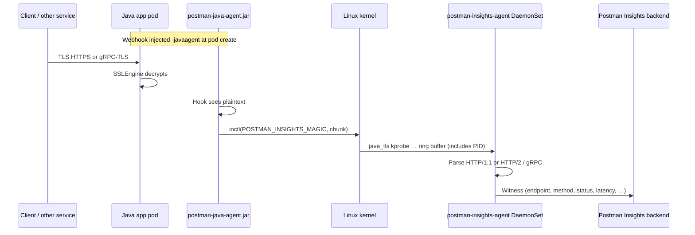

# Kind E2E Demo — HTTPS + gRPC Capture via eBPF

**Copy this document into Google Docs** (`File → Import → Upload`) or paste section-by-section.  
**Audience:** Engineering demo / stakeholder walkthrough · **Production install:** see **§5.4**  
**Cluster:** `kind-pia-https-test` · **Setup:** `./test/kind/deploy-e2e-demo.sh`

---

## 1. Executive summary

The Postman Insights Agent can observe **HTTPS and gRPC-TLS traffic inside Kubernetes pods** without terminating TLS at a proxy or modifying application code (for OpenSSL-based runtimes). This demo runs two sample services in Kind:

| Service | Runtime | Capture component | Status in Kind demo |
|---------|---------|-------------------|---------------------|
| **java-service** | JVM + java-agent | `postman-insights-agent` DaemonSet (`--enable-java-tls`) | ✅ HTTPS + gRPC working |
| **node-service** | Node.js (Debian / dynamic libssl) | `postman-insights-agent` DaemonSet | ✅ Working (restart DS after pod up — see setup script) |
| **node-service** | Node.js (official `node:20` / static BoringSSL) | Same DaemonSet | ⚠️ WIP in Kind |

---

## 2. What is eBPF?

**eBPF (extended Berkeley Packet Filter)** is a Linux kernel feature that lets verified programs run safely inside the kernel in response to events (network packets, system calls, function entry/exit, etc.).

For this project we use **eBPF uprobes**: hooks placed on functions inside a process’s loaded libraries (or binary). When the application calls `SSL_read` / `SSL_write` (OpenSSL) or when our Java agent sends plaintext via a custom `ioctl`, the kernel runs our BPF program, which copies a bounded slice of **already-decrypted** bytes to userspace.

**Why not libpcap alone?**  
Classic packet capture sees **encrypted TLS on the wire**. Without private keys or a MITM proxy, you cannot parse HTTP or gRPC. eBPF uprobes observe TLS **after** the library has decrypted data in process memory.

---

## 3. Why eBPF is needed for API insights

| Approach | Sees HTTPS plaintext? | App changes? | Pod-local? |
|----------|----------------------|--------------|------------|
| libpcap on NIC | ❌ Encrypted | None | Yes |
| Service mesh / sidecar proxy | ✅ If proxy terminates TLS | Infra change | Sidecar |
| **eBPF uprobes (this work)** | ✅ After TLS in-process | None for Node/OpenSSL; small Java agent | DaemonSet on node |

Goal: discover endpoints, methods, latency, and errors for APIs that only speak HTTPS—typical for microservices in Kubernetes.

---

## 4. Overview of code changes (this branch)

High-level additions on `feat/https-capture-ebpf`:

| Area | Purpose |
|------|---------|
| `ebpf/` | BPF programs, libssl uprobes, event pipeline → HTTP/gRPC parsing |
| `ebpf/uprobes/static_openssl.go` | Node.js static BoringSSL discovery (ELF `SSL_*` symbols) |
| `ebpf/discovery/` | PID scan + K8s namespace filter via CRI/cgroup inode |
| `cmd/internal/apidump-ebpf/` | Spike CLI: attach libssl, log REQ/RESP to stdout |
| `cmd/internal/apidump-javatls/` | Spike CLI: Java `ioctl` path |
| `java-agent/` | ByteBuddy hooks on `SSLEngine` → plaintext to eBPF |
| `test/kind/` | Kind cluster, DaemonSet, java-service + node-service workloads |

Production path: `apidump --enable-https-capture` on a **single** agent DaemonSet per node.  
See **§5.4** for the full production install model (DaemonSet + Java webhook). The Kind demo in §5.1–§5.3 splits Java capture into a separate `javatls-capture` pod for debugging only.

---

## 5. Architecture — how capture works for Java vs Node

### 5.1 Cluster layout (this demo)

```
┌──────────────────────── kind cluster (pia-https-test) ────────────────────────┐
│                                                                               │
│  namespace: postman-insights                                                  │
│    └─ DaemonSet  postman-insights-agent                                       │
│         ├─ libssl uprobes      → Node, nginx, …                               │
│         └─ java_tls kprobe     → JVMs with postman-java-agent (--enable-java-tls) │
│                                                                               │
│  namespace: test-apps                                                         │
│    ├─ Pod java-service   :8443 HTTPS  :8446 gRPC  (+ postman-java-agent)      │
│    └─ Pod node-service   :8443 HTTPS  :8446 gRPC  (dynamic libssl.so.3)       │
│                                                                               │
└───────────────────────────────────────────────────────────────────────────────┘
```

### 5.2 Java flow (agent + javatls-capture)



**Pods involved:** `test-apps/java-service`, `postman-insights/javatls-capture`  
**Not used for Java:** libssl DaemonSet uprobes (JVM does not use libssl the same way).

### 5.3 Node.js flow (DaemonSet / libssl uprobes)



**Pods involved:** `test-apps/node-service`, `postman-insights/postman-insights-agent` (DaemonSet)  
**Not used for Node:** `javatls-capture`.

### 5.4 Production installation — DaemonSet + Java (install reference)

> **Use this section as the basis for the production DaemonSet install guide.**  
> The Kind demo (§5.1–§5.3, §7–§9) deliberately runs **two** capture pods for easier debugging. **Do not deploy `javatls-capture` in production.**

#### Demo vs production

| | Kind demo (this doc, §7–§9) | Production |
|---|---------------------------|------------|
| **Capture agent** | Split: DaemonSet (Node) + `javatls-capture` Deployment (Java) | **One** `postman-insights-agent` DaemonSet per node |
| **Agent command** | `apidump-ebpf` / `apidump-javatls` (spike CLIs, stdout logging) | `apidump --enable-https-capture` (+ Postman service URI) |
| **Output** | `kubectl logs` → `REQ` / `RESP` lines | Postman Insights backend (same pipeline as HTTP/pcap today) |
| **Java agent in app pods** | Manual init container in `java-service-workload.yaml` | Mutating admission **webhook** auto-injects `-javaagent` |
| **Install `javatls-capture`?** | Yes (demo only) | **No** |

#### What to install (production checklist)

| # | Component | Where | Install once per | Purpose |
|---|-----------|-------|------------------|---------|
| 1 | **`postman-insights-agent` DaemonSet** | Every cluster node (`postman-insights` namespace) | Node | libssl uprobes (Node, Python, nginx, …) **+** `java_tls` eBPF kprobe **+** ship witnesses to Postman |
| 2 | **Mutating admission webhook** | Cluster-level Helm release | Cluster | Auto-inject `postman-java-agent.jar` into Java pods in opted-in namespaces |
| — | ~~`javatls-capture` Deployment~~ | — | — | **Demo spike only — do not install** |

**References:**

- DaemonSet privileges, volumes, namespace filtering: [`docs/https-capture-design.md`](https-capture-design.md) §8  
- Webhook install, upgrade, rollback, troubleshooting: [`docs/webhook-runbook.md`](webhook-runbook.md)  
- Webhook Helm chart: `charts/postman-insights-webhook/`

#### Production cluster layout

```
┌──────────────────────── Kubernetes cluster ────────────────────────────────────┐
│                                                                                │
│  namespace: postman-insights                                                   │
│    ├─ DaemonSet  postman-insights-agent                                      │
│    │     • libssl uprobes  → Node / Python / nginx / …                         │
│    │     • java_tls kprobe → all JVMs on this node that emit the magic ioctl   │
│    │     • apidump --enable-https-capture → Postman Insights backend           │
│    └─ Deployment postman-insights-webhook  (mutating admission)                 │
│                                                                                │
│  namespace: <customer-apps>  (label: postman.com/insights=enabled)             │
│    ├─ Pod orders-api     (Java)   ← webhook adds -javaagent + JAR volume       │
│    ├─ Pod payments-svc   (Java)   ← same                                       │
│    └─ Pod gateway        (Node)   ← no java-agent; libssl uprobes only         │
│                                                                                │
└────────────────────────────────────────────────────────────────────────────────┘
```

#### Two parts for Java capture (both required)

Java TLS lives entirely in the JVM (`SSLEngine`), not in libssl. Production needs **two cooperating pieces**:

**A. In each Java app pod — `postman-java-agent.jar`**

| | |
|---|---|
| **What** | Small ByteBuddy agent (`-javaagent:/postman/postman-java-agent.jar`) |
| **How it arrives** | Webhook sets `JAVA_TOOL_OPTIONS` and an init container copies the JAR from the agent image into a shared volume |
| **What it does** | Hooks `SSLEngine.wrap` / `unwrap` (and Netty/Jetty paths); on each TLS read/write, copies a bounded plaintext slice and calls `ioctl(fd=0, cmd=0x0b10b1, buffer)` |
| **Without it** | The DaemonSet sees **zero** Java HTTPS/gRPC traffic from that JVM |

**B. In the DaemonSet agent — `java_tls` eBPF program**

| | |
|---|---|
| **What** | One **global** kprobe on `sys_ioctl` (same binary as libssl capture — not a separate pod) |
| **What it does** | Recognizes the magic ioctl from (A), copies plaintext + PID into a ring buffer, feeds the **same** HTTP/gRPC parser and `trace.Collector` → Postman backend as libssl events |
| **Demo equivalent** | The standalone `javatls-capture` pod — **merged into the DaemonSet in production** |



#### How the DaemonSet “knows” about Java services

The agent does **not** maintain a catalog of Java services or endpoints. It observes **live traffic** from JVMs that have the agent loaded.

**Discovery model — Java vs OpenSSL (important difference):**

| Runtime | How capture attaches | How the agent finds workloads |
|---------|---------------------|------------------------------|
| **Node / Python / nginx** (libssl) | **Active:** scan `/proc` + CRI → find PIDs with `libssl` mapped → attach uprobes **per PID** | Must discover and attach before traffic is seen |
| **Java** (JVM) | **Passive:** one kprobe on `sys_ioctl` on the node; no per-PID uprobe attach | Any process on the node that calls the magic ioctl is captured; event carries **PID** |

**End-to-end flow:**

1. Customer labels a namespace (e.g. `postman.com/insights=enabled`).
2. Webhook mutates new Java pods → `JAVA_TOOL_OPTIONS=-javaagent:…` + init container seeds the JAR.
3. JVM starts; agent attaches at premain.
4. On HTTPS/gRPC traffic, agent fires `ioctl` with plaintext chunks.
5. DaemonSet `java_tls` kprobe receives events (with PID) → parser → backend.

**Namespace scoping:** use the same `--https-target-namespaces` / discovery config as libssl capture. The CRI + cgroup resolver maps PID → namespace so only opted-in namespaces are processed, redacted, and shipped. Optional BPF PID allowlist (`java_target_pids`) can further restrict emission when `enforce_pid_allowlist=true` (Kind demo uses “capture all on node” mode).

**What production cannot see:**

- Java pods **without** the agent (webhook disabled, namespace not opted in, image not matched by webhook regex).
- JVM traffic before agent premain completes (usually negligible).

#### DaemonSet agent configuration (production)

The production DaemonSet runs the **main** agent entrypoint, not the spike CLIs:

```text
postman-insights-agent apidump \
  --enable-https-capture \
  --https-target-namespaces=<ns1,ns2,...> \
  … (Postman service URI, discovery mode, etc.)
```

All runtimes on a node feed **one** collector chain:

```text
libpcap (HTTP) ──┐
libssl uprobes   ├──► akinet parsers ──► trace.Collector ──► Postman Insights API
java_tls kprobe  ──┘
(go_tls uprobes) ──┘   ← when enabled
```

Spike commands `apidump-ebpf` and `apidump-javatls` exist only for Kind/dev validation; they log to stdout and are **not** the production command.

#### Webhook (Java agent delivery)

Install **once per cluster** (separate from the DaemonSet):

```bash
# See docs/webhook-runbook.md for full steps, TLS, and rollback.
helm install postman-insights-webhook ./charts/postman-insights-webhook \
  -n postman-insights \
  --set namespaceSelector.matchLabels."postman\.dev/insights"=enabled
```

The webhook:

- Matches Java container images (configurable regex).
- Adds init container + volume mount + `JAVA_TOOL_OPTIONS`.
- Does **not** capture traffic itself — it only ensures the JVM can emit plaintext for the DaemonSet to pick up.

#### Operator summary

| Question | Answer |
|----------|--------|
| Install a separate Java capture pod? | **No** — `java_tls` runs inside the existing DaemonSet |
| How does Java traffic reach Postman? | JAR in app pod → ioctl → DaemonSet kprobe → same backend as Node |
| How do we opt in Java namespaces? | Namespace label + webhook + `--https-target-namespaces` on DaemonSet |
| Do we need app code changes? | No Java code changes; webhook injects `-javaagent` automatically |
| Where is gRPC URL learned? | From HTTP/2 `:path` on the wire (e.g. `/com.acme.Service/Method`) — no `.proto` on the agent |

---

## 6. How “decryption” works (plain language)

We **do not break TLS** or decrypt ciphertext from the network.

1. The application’s TLS library (OpenSSL/libssl or JVM `SSLEngine`) decrypts traffic **inside the process** as part of normal operation.
2. Our hooks read **plaintext buffers at those library boundaries**:
   - **Node / OpenSSL apps:** uprobes on `SSL_read`, `SSL_write`, etc.
   - **Java:** in-process agent after `SSLEngine.unwrap` / `wrap`.
3. Bytes are capped (e.g. 512–1024 bytes per event), optionally redacted, and parsed as HTTP/1.1 or HTTP/2 (gRPC uses HTTP/2 framing).

So “decryption” in docs means **observing post-TLS plaintext**, not cryptanalysis.

---

## 7. One-time setup

From repo root on Mac (Docker Desktop running):

```bash
./test/kind/deploy-e2e-demo.sh
```

This builds images, loads them into Kind, and starts:

- `postman-insights-agent` DaemonSet  
- `javatls-capture` Deployment  
- `java-service` and `node-service` in `test-apps`  
- Background `team-py` / `team-srv` clients (proves DaemonSet liveness)

The script **restarts the DaemonSet after both services are Ready** so libssl uprobes attach to the live Node PIDs (required for reliable Node capture in Kind).

Trust certificate for Mac clients:

```text
test/kind/certs/hello-https-trust.pem
```

---

## 8. Java service demo

### 8.1 Pods and roles

| Pod | Namespace | Role |
|-----|-----------|------|
| `java-service` | `test-apps` | Combined HTTPS + gRPC server (JVM + java-agent) |
| `postman-insights-agent` | `postman-insights` | DaemonSet — captures Java plaintext via `--enable-java-tls` |

### 8.2 Port-forward (Terminal 1)

```bash
kubectl port-forward -n test-apps pod/java-service 8443:8443 8446:8446
```

Use **`https://127.0.0.1:8443`** for curl (cert CN is `localhost`; `127.0.0.1` alone fails cert verify).

### 8.3 HTTPS (Terminal 2)

```bash
CACERT=test/kind/certs/hello-https-trust.pem
curl --cacert "$CACERT" https://127.0.0.1:8443/phase5b2
```

Expected body: `hello-from-combined-server phase=5b2` (or similar from `CombinedServer`).

### 8.4 gRPC-TLS (Terminal 2)

```bash
grpcurl -cacert "$CACERT" \
  -import-path java-agent/testdata/grpc-java/src/main/proto -proto greeter.proto \
  -d '{"name":"demo"}' \
  localhost:8446 phase5c2.Greeter/SayHello
```

Using `-proto greeter.proto` avoids grpcurl's server-reflection probe (`/grpc.reflection.v1alpha.ServerReflection/ServerReflectionInfo`), which otherwise appears as extra REQ lines in capture logs.

Or in-cluster (no port-forward):

```bash
JAVA_IP=$(kubectl get pod -n test-apps java-service -o jsonpath='{.status.podIP}')
kubectl run grpc-test --restart=Never -n test-apps --image=fullstorydev/grpcurl:latest --rm -i \
  -- -insecure -d '{"name":"demo"}' ${JAVA_IP}:8446 phase5c2.Greeter/SayHello
```

### 8.5 Check capture logs (Terminal 3)

```bash
kubectl logs -n postman-insights daemonset/postman-insights-agent -f
```

Filter:

```bash
kubectl logs -n postman-insights daemonset/postman-insights-agent --since=1m | grep -E 'phase5|Greeter|REQ|RESP'
```

**Example output:**

```text
REQ  pid=ebpf-pid-12345 method=GET url=/phase5b2
RESP pid=ebpf-pid-12345 status=200
REQ  pid=ebpf-pid-12345 method=POST url=https://localhost/phase5c2.Greeter/SayHello
RESP pid=ebpf-pid-12345 status=200
```

(gRPC often shows **2 REQ + 1 RESP per RPC** because HTTP/2 sends trailer HEADERS.)

---

## 9. Node.js service demo

### 9.1 Pods and roles

| Pod | Namespace | Role |
|-----|-----------|------|
| `node-service` | `test-apps` | Combined HTTPS + gRPC server (dynamic libssl) |
| `postman-insights-agent` | `postman-insights` | DaemonSet — libssl uprobes |

### 9.2 Port-forward (Terminal 1)

```bash
kubectl port-forward -n test-apps pod/node-service 8443:8443 8446:8446
```

### 9.3 HTTPS (Terminal 2)

```bash
CACERT=test/kind/certs/hello-https-trust.pem
curl --cacert "$CACERT" https://127.0.0.1:8443/phase5b2
```

### 9.4 gRPC-TLS (Terminal 2)

```bash
grpcurl -cacert "$CACERT" \
  -import-path test/kind/node-service/proto -proto greeter.proto \
  -d '{"name":"from-mac"}' \
  localhost:8446 phase5c2.Greeter/SayHello
```

**Alternative — in-pod client:**

```bash
kubectl exec -n test-apps node-service -- node client.js
```

### 9.5 Check capture logs (Terminal 3)

```bash
kubectl logs -n postman-insights daemonset/postman-insights-agent -f
```

Filter:

```bash
kubectl logs -n postman-insights daemonset/postman-insights-agent --since=1m \
  | grep -E 'phase5b2|Greeter|attached.*node|REQ |RESP '
```

**Example output:**

```text
ebpf: attached libssl uprobes pid=… path=…/libssl.so.3 static=false probes=10
REQ  … method=GET url=/phase5b2
RESP … status=200
REQ  … method=POST url=…/phase5c2.Greeter/SayHello
RESP … status=200
```

### 9.6 In-cluster curl (no port-forward)

```bash
POD_IP=$(kubectl get pod -n test-apps node-service -o jsonpath='{.status.podIP}')
kubectl delete pod -n test-apps curl-node --ignore-not-found
kubectl run curl-node --restart=Never -n test-apps --image=curlimages/curl:latest --rm -i \
  -- curl -sk "https://${POD_IP}:8443/phase5b2"
```

(`curl-node` is deleted first if a previous run left the pod behind — `--rm` only cleans up after a successful completion.)

Then grep DaemonSet logs for `phase5b2`.

### 9.7 In-pod client (`client.js`) — capture gotchas

```bash
kubectl exec -n test-apps node-service -- node client.js
```

This hits `127.0.0.1` inside the pod (loopback). The server returns 200, but capture may **not** appear in DaemonSet logs if:

1. **Uprobes attached to a stale PID** — discovery runs on a 2s poll; if the DaemonSet started before `node-service` was ready, or the pod restarted, the agent may have attached to an old/dead PID. **Fix:** restart the DaemonSet after `node-service` is Ready (the deploy script does this automatically).

2. **Wrong grep** — loopback traffic often logs as `0.0.0.0:0` with no obvious host. Grep for the path, not just `REQ`:

   ```bash
   kubectl logs -n postman-insights daemonset/postman-insights-agent --since=2m \
     | grep -E 'phase5b2|Greeter|SayHello'
   ```

3. **gRPC lines may be missing** — the spike CLI reliably shows HTTPS `GET /phase5b2`; gRPC `SayHello` POST lines are less consistent in Kind stdout (HTTP/2 mid-stream attach).

**Reliable verify sequence:**

```bash
# 1. Confirm node-service is Ready
kubectl wait -n test-apps --for=condition=Ready pod/node-service --timeout=60s

# 2. Restart capture agent so it attaches to the live node PID
kubectl rollout restart -n postman-insights daemonset/postman-insights-agent
kubectl rollout status -n postman-insights daemonset/postman-insights-agent --timeout=120s
sleep 10

# 3. Confirm libssl attach (look for node server.js PID on the kind node)
kubectl logs -n postman-insights daemonset/postman-insights-agent --since=2m \
  | grep 'attached libssl'

# 4. Generate traffic (pod IP curl is more reliable than loopback client.js)
POD_IP=$(kubectl get pod -n test-apps node-service -o jsonpath='{.status.podIP}')
kubectl delete pod -n test-apps curl-node --ignore-not-found
kubectl run curl-node --restart=Never -n test-apps --image=curlimages/curl:latest --rm -i \
  -- curl -sk "https://${POD_IP}:8443/phase5b2"

# 5. Check logs
kubectl logs -n postman-insights daemonset/postman-insights-agent --since=1m \
  | grep -E 'phase5b2|Greeter'
```

If attach logs show PIDs for `team-py` / nginx but **never** a PID matching the current `node-service` container, recreate the node pod and restart the DaemonSet again.

---

## 10. Go / Golang services (reference — not in this Kind demo)

Go services using **`crypto/tls`** are supported on this branch via **Go TLS uprobes** on the same DaemonSet (design doc Phase 3). This Kind demo does **not** include a Go sample pod yet; the flow is analogous to Node:

- DaemonSet discovers Go binary with TLS symbols  
- Uprobes on `crypto/tls` read/write paths  
- Logs: same `kubectl logs … daemonset/postman-insights-agent`

*(If you meant **Node.js** rather than Go, see Section 9.)*

**Work in progress:** add `go-service` workload to `test/kind/` for parity with Java/Node.

---

## 11. Work in progress & known limitations

| Item | Status | Notes |
|------|--------|-------|
| **gRPC response bodies** | ⚠️ Partial | Spike logs method, URL, status — not full protobuf message bodies in stdout |
| **IP:port in spike logs** | ⚠️ Partial | Often `0.0.0.0:0` until fd→4-tuple resolver fully wired |
| **Production backend** | 🔜 | Spike uses stdout; production sends to Postman Insights API |
| **Go kind workload** | 🔜 | Not yet in `test/kind/` |
| **Single unified DaemonSet** | 🔜 | Java + libssl merge into one DaemonSet — see **§5.4**; `javatls-capture` is demo-only |

---

## 12. Troubleshooting cheat sheet

| Symptom | Check |
|---------|--------|
| Port-forward connection refused | `kubectl logs -n test-apps java-service` / `node-service` — server must be listening |
| curl cert error | Use `--cacert test/kind/certs/hello-https-trust.pem` and host **`127.0.0.1`** or **`localhost`** consistently |
| No Java capture | `kubectl logs daemonset/postman-insights-agent -n postman-insights`; confirm `-javaagent` in java-service and `--enable-java-tls` on DaemonSet |
| No Node capture | Restart DaemonSet after node-service is Ready: `kubectl rollout restart -n postman-insights daemonset/postman-insights-agent`; wait ~10s. Grep `phase5b2`, not bare `REQ`. See §9.7. |
| `client.js` returns 200 but no logs | Uprobes likely on stale PID — §9.7 verify sequence; prefer pod-IP curl over loopback |
| Wrong capture component | Both Java and Node → `postman-insights-agent` DaemonSet. Java requires `--enable-java-tls` flag (see `agent-daemonset-prod.yaml`). |

---

## 13. Cleanup

```bash
kind delete cluster --name pia-https-test
```

---

## 14. Demo checklist (presenter)

- [ ] `./test/kind/deploy-e2e-demo.sh` completed; all pods Running  
- [ ] Java HTTPS curl → DaemonSet shows `phase5b2`  
- [ ] Java grpcurl → `Greeter/SayHello` in DaemonSet logs  
- [ ] Node HTTPS curl → DaemonSet shows `phase5b2`  
- [ ] Node grpcurl or `client.js` → DaemonSet shows gRPC POST  
- [ ] Mention WIP: static Node in Kind, gRPC body decoding, unified DaemonSet (§5.4)  
- [ ] For production audiences: walk through §5.4 install checklist (DaemonSet + webhook, no javatls-capture)  

---

*Document version: matches `test/kind/deploy-e2e-demo.sh` and dynamic Node workload. §5.4 is the production DaemonSet install reference.*
